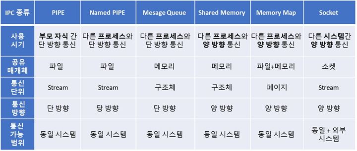

## 프로세스 간 통신 IPC (Inter Process Communication)

프로세스들은 서로 완전히 독립되어 있다.

따라서 서로 영향을 받지 않는다는 장점이 있지만, 별도의 기술 없이는 서로 통신이 어렵다는 단점이 있다. 

따라서 커널 영역에서 IPC를 제공하고, 각 프로세스들은 이 IPC를 이용해 프로세스간 통신을 할 수 있다. 

### 필요한 이유

- 정보 공유 : 여러 사용자가 동일한 정보를 필요로 할 수 있음
- 계산 가속화 : 특정 작업을 빠르게 수행하기 위해, 병렬로 실행하게 할 수 있다.
- 모듈성 : 특정 시스템 기능을 별도의 프로세스로 구분하여 모듈식 형태로 시스템을 구성할 수 있다.
- 편의성 : 여러 사용자들이 동시에 많은 작업을 수행할 수 있다. 

### 종류

https://rebas.kr/854

1. [PIPE](#pipe)
2. [Named PIPE](#named-pipe)
3. [Message Queue](#message-queue)
4. [Shared Memory](#shared-memory)
5. [Memory Map](#momory-map)
6. [Socket](#socket) 

#### PIPE (익명 PIPE)

1. 정의 : 동일한 PPID를 가진 프로세스들 간 단방향 통신을 지원한다.

2. 구조 : FIFO, 단방향

3. 사용하는 경우 : 부모-자식 프로세스간 통신할 때 사용한다. 

   송신자와 수신자가 매번 같은 단순한 데이터 흐름을 가질 때 사용하면 좋다. 

4. 유의사항

   단방향 통신이므로, 양방향 통신을 위해서는 두 개의 PIPE를 만들어 이용해야 한다.

   그리고 2개의 PIPE를 이용한다 하더라도, read(), write()가 block모드로 작동하기 때문에 둘을 동시에 할 수는 없다. (read 후에 write하는 식으로 해야함)

   하지만 이는 구현이 꽤나 복잡해서 전이중 통신을 고려할 때, PIPE는 좋은 선택이 아니다. 

5. 장점

   매우 간단하게 사용할 수 있다.

6. 단점

   커널을 이용하기 때문에, System call이 필요하며 이로인한 오버헤드가 발생한다. 

** PPID (Parent Process Identification Number) : 프로세스를 만든 부모 프로세스의 PID

#### Named PIPE

1. 정의 :

   부모자식간이 아닌 서로 다른 프로세스 간에서 단방향 통신을 지원한다. 

   같은 PPID를 가진 경우에만 통신이 가능한 PIPE의 단점을 보완한 방식이다. 

   프로세스 통신을 위해 '이름이 있는 파일'을 사용하기 때문에 가능하다. 

   > Named PIPE의 생성은 mkfifo를 통해 이루어진다. 
   >
   > 이 명령어가 성공하면 '이름이 있는 파일'이 생성된다. 

2. 구조 : FIFO, 단방향

3. 사용하는 경우 : 서로 다른 프로세스들 간에 단방향 통신을 할 때

4. 유의 사항

   PIPE와 마찬가지로 양 방향 통신을 위해서는 PIPE 2개를 구축해야 한다. 

#### Message Queue

1. 정의 : 

   메모리 공간(메세지 큐)을 이용한다.

   > PIPE는 데이터의 흐름이라고 볼 수 있다.
   >
   > PIPE와 다르게 큐는 물건을 꺼낼 수 있는 컨베이어 벨트라고 볼 수 있다. 

   구조체 기반으로 통신한다. 

2. 구조 : FIFO, MsgType에 따라 다른 구조체를 가져올 수 있다.

3. 사용하는 경우 : 프로세스 간 다양한 통신을 할 때 사용한다. 

   메세지 큐에 넣는 데이터에 '번호'를 붙임으로써 여러 개의 프로세스가 동시에 데이터를 쉽게 다룰 수 있다. 

4. 장점

   비동기 방식이기에 큐에 넣은 후 나중에 처리할 수 있다.

5. 단점

   메세지가 잘 전달되었는지 알 수 없다.

   데이터가 많이 쌓일수록 추가적인 메모리 자원이 필요하다. 

#### Shared Memory

1. 정의 : 시스템 상의 **공유 메모리**를 통해 통신한다.

2. 구조 :

   일정한 크기의 메모리를 프로세스간에 공유하는 구조이다.

   이 공유메모리는 커널에서 관리한다.

   > 위의 세 가지 방식이 통신을 이용한다면, 이 방식은 데이터 자체를 공유하도록 한다. 

3. 사용하는 경우 : 프로세스 간 Read, Write를 모두 필요로 할 때 사용한다. 

   > 프로세스가 공유 메모리 할당을 요청하면, 커널은 해당 프로세스에 공간을 할당해준다.
   >
   > 이후 다른 프로세스가 해당 영역에 접근할 수 있다.

4. 유의 사항

   프로세스 간 메모리 크기가 동일해야 사용할 수 있다. 

5. 장점

   중재자가 없이 곧바로 메모리에 접근할 수 있기 때문에, 가장 빠르게 작동할 수 있다. 

#### Memory Map

1. 정의 : 파일을 프로세스의 메모리에 일부 맵핑 시켜서 사용한다.

   > 메모리를 공유한다는 측면에서 Shared Memory 방식과 비슷하다.
   >
   > 하지만 이 경우에는 열린 파일을 메모리에 맵핑시켜 공유한다는 차이점이 있다. 
   >
   > 파일은 시스템의 전역적인 자원이므로 서로 다른 프로세스들끼리 데이터를 공유하는 데 문제가 없다. 

2. 구조

3. 사용하는 경우 :

   파일로 대용량 데이터를 공유하는 경우

   FILE IO가 느릴 때

   대부분의 OS에서는 프로세스를 실행할 때, 실행 파일의 각 세그먼트를 메모리에 사상하기 위해 메모리 맵 파일을 이용한다. 

4. 유의 사항

   - 프로세스의 페이지가 메모리에서 내려갈 때에만 write된다. 따라서 메모리와 file sync가 안 맞을 수 있다. 
   - IA-32기반 시스템에서 하나의 프로세스에서 PAE를 사용하지 않고 사용 가능한 최대 크기는 4GB이다. 
   - 메모리 맵 파일은 파일의 크기를 바꿀 수는 없으며, 메모리 맵 파일을 사용하기 전이나 후에만 파일의 크기를 바꿀 수 있다. 

5. 장점

   데이터가 메모리에 이미 올라와있는 것 처럼 간단하게 접근할 수 있다. 

   파일 IO에 비해 나은 성능을 보여준다. 

6. 단점

   파일 IO에 비해 많은 메모리를 요구한다.

   데이터를 얼마나 오랫동안 메모리에 둘 것인지 컨트롤할 수 없다. 

** PAE (Physical Address Extension) (????)

#### Socket 

1. 정의 : 네트워크 소켓 통신을 사용한 데이터 공유 방식이다.

2. 구조 : 네트워크 소켓을 사용하여 Client - Server 구조로 통신한다. 

   > sys/socket.h 헤더를 이용해 사용할 수 있다. 

3. 사용하는 경우 : 원격으로 프로세스 간 데이터를 공유할 때 사용 

4. 유의 사항 :

   네트워크 프로그래밍이 가능해야 한다.

   데이터 세그먼트 처리를 잘해야 한다.

5. 과정 

   server : bind, listen, accept 를 해주어 소켓 연결을 위한 준비를 해야한다.

   client : connect를 통해 서버에 요청

   연결 수립 이후에는 socket을 send함으로써 데이터를 주고받게 된다. 

   연결이 끝난 후에는 반드시 socket을 닫아주어야 한다. 

### 스레드 간 통신보다 프로세스 간 통신이 어려운 이유

프로세스는 별도의 자원을 가지지만, 스레드는 메모리 공간과 자원을 공유하기 때문이다.

따라서 프로세스는 통신을 위한 별도의 공간을 만들어주어야 하기 때문에 스레드 간 통신보다 어렵다. 

